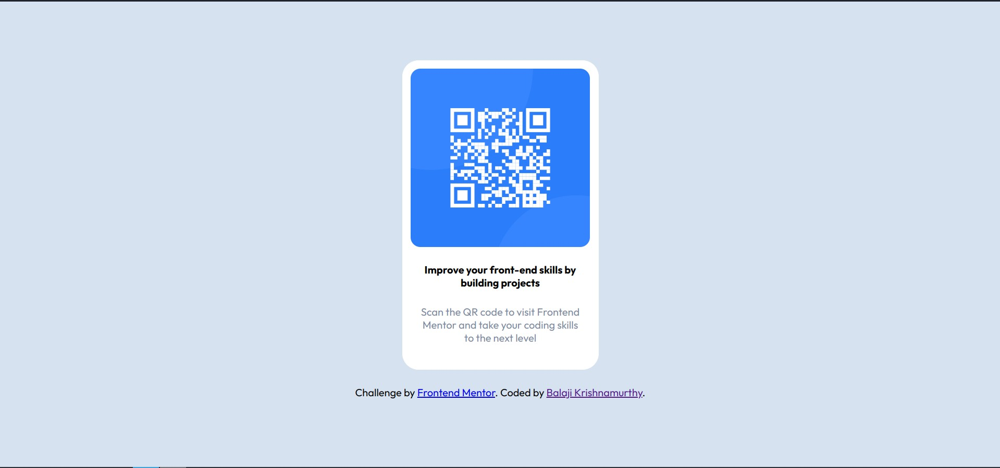

# Frontend Mentor - QR code component solution

## Overview

This is a solution to the [QR code component challenge on Frontend Mentor](https://www.frontendmentor.io/challenges/qr-code-component-iux_sIO_H). Frontend Mentor challenges help you improve your coding skills by building realistic projects. 

## Table of contents

- [Overview](#overview)
  - [Screenshot](#screenshot)
  - [Links](#links)
- [Author](#author)

### Screenshot

### Links

- Solution URL: [Add solution URL here](https://github.com/BKM14/qr-code-component/)
- Live Site URL: [Add live site URL here](https://bkm14.github.io/qr-code-component/)

### Built with

- Semantic HTML5 markup
- CSS custom properties
- Flexbox

## Author

- Website - [Balaji Krishnamurthy](https://github.com/BKM14/)
- Frontend Mentor - [@BKM14](https://www.frontendmentor.io/profile/BKM14)
- Twitter - [@balajikm86](https://www.twitter.com/balajikm86)